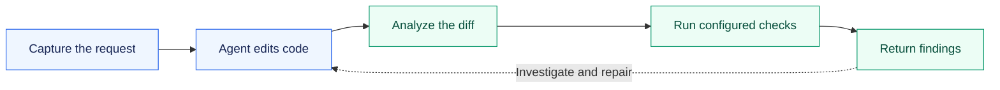

<div align="center">

# Proof-Jev

### Your coding agent writes the change. Proof-Jev checks the evidence.

Catch regressions. Challenge passing tests. Keep verification tied to the task.

[](https://github.com/hamza-paracha/proof-jev/actions/workflows/ci.yml)
[](package.json)
[](LICENSE)

[Quick start](#quick-start) · [Connect your agent](#connect-your-agent) · [See the evidence](docs/validation.md) · [Documentation](#documentation)

</div>

---

Proof-Jev runs alongside a coding agent. It reads the Git diff, traces changed JavaScript/TypeScript functions to affected tests, and checks whether those tests catch deliberate bugs. Findings come back with source locations, exact patches, and command results. A failing check sends its assertion excerpt directly back to the agent.

Code analysis and mutation testing run locally without an API key. Optional **Jev review** adds structured judgments about validation, errors, side effects, and whether a change contradicts the original request.

## From prompt to evidence



| While the agent works | What Proof-Jev does |
| :--- | :--- |
| **At the prompt** | Captures the request, Git base, and configured test commands. |
| **After edits** | Analyzes changed code and identifies affected tests. |
| **Before completion** | Runs configured tests, named acceptance checks, and a bounded mutation sample when execution is enabled. |
| **After another edit** | Invalidates old results so stale evidence cannot count as a pass. |

Local Codex hooks connect these steps automatically after installation and trust. Other harnesses can use the same lifecycle through MCP or a JSON Lines subprocess. **One verification job per server at a time**, with throttled analysis and a default task limit of three sampled mutations. [How the loop works →](docs/task-loop.md)

## Passing tests can still miss the bug

Free shipping starts at **50**. Tests for orders of 20 and 80 pass—but never check the boundary or invalid input. Proof-Jev changes the code in disposable copies to find out what the tests actually protect.

| Deliberate fault | Ordinary tests | Boundary + error assertions |
| :--- | :---: | :---: |
| Change `>= 50` back to `> 50` | Missed | **Caught** |
| Reject zero as an invalid total | Missed | **Caught** |
| Remove negative-total validation | Missed | **Caught** |

Each surviving mutation includes its exact patch and source location. The agent can investigate the intended behavior and add a focused assertion. A survivor can also be equivalent or unreachable code; it needs judgment.

**Try this example:** `npm run verify:change-demo` after the setup below. It compares the same three mutations before and after adding the missing assertions, with no model calls.

## Quick start

Requires **Node.js 22+**, npm, and Git.

```sh
git clone https://github.com/hamza-paracha/proof-jev.git
cd proof-jev
npm ci

# Inspect changed code without executing the target project's tests
node bin/vouch.mjs analyze --project /path/to/your-repo --base HEAD
```

`HEAD` compares staged, unstaged, and untracked files with the current commit. To check committed work, choose the commit before the change.

To run mutation checks, add **`vouch.config.json`** to the target repository using its actual test command:

```json
{
  "testCommand": ["npm", "test"],
  "maxMutants": 3,
  "commandTimeoutMs": 15000,
  "totalTimeoutMs": 60000
}
```

```sh
node bin/vouch.mjs verify-change --project /path/to/your-repo --base HEAD --allow-exec
```

Tests run in disposable copies. If they need installed dependencies, configure a `setupCommand`; dependencies are not installed automatically. Results include **detected, surviving, invalid, inconclusive, and untested** mutations, with JSON, Markdown, and standalone HTML reports.

[Test commands, dependency setup, and execution limits →](docs/code-verification.md)

## Connect your agent

| Integration | Connection | Lifecycle |
| :--- | :--- | :--- |
| **Local Codex** | Install the plugin and trust its definitions in `/hooks`. | Automatic prompt, edit, completion, and interrupt callbacks. |
| **Claude Code** | Load the plugin with `--plugin-dir`. | Tools and skills; automatic lifecycle wiring is not bundled. |
| **Your own harness** | MCP `task_event`, JSON Lines, or the Node adapter. | Your host forwards events and handles the returned verdict. |

Build and check the plugin:

```sh
npm run plugin:build
npm run verify:plugin
```

Install **`out/plugin/proof-jev`** through your local Codex marketplace, or load it in Claude Code:

```sh
claude --plugin-dir /absolute/path/to/proof-jev/out/plugin/proof-jev
```

Start a fresh host session in the target Git repository, then ask:

> Check whether my tests would catch bugs in this change. Investigate surviving mutations and add focused regression tests for real gaps.

**Analysis is available without execution permission.** Tests also require `vouch.config.json` and `VOUCH_ALLOW_EXECUTION=1` in the MCP server environment. Jev review requires separate provider and budget configuration. Codex can request one repair continuation, then reports any unresolved verification.

[Plugin setup →](docs/plugin.md) · [Build a harness adapter →](docs/task-loop.md) · [Enable Jev review →](docs/structured-review.md)

<details>
<summary><strong>Eight MCP tools</strong></summary>

| Tool | Purpose |
| :--- | :--- |
| `get_setup_status` | Check project, test execution, and optional review readiness. |
| `analyze_change` | Identify changed functions, affected tests, and candidate faults. |
| `verify_change` | Challenge configured tests with bounded mutations. |
| `review_change` | Review changed code with Jev. |
| `check_file` | Review one changed file. |
| `assess_pr` | Review local changes and assess their scope. |
| `task_event` | Start, check, complete, inspect, or cancel a verification task. |
| `task_hook` | Handle automatic Codex lifecycle events. |

To register MCP directly, run `node /absolute/path/to/proof-jev/bin/vouch.mjs --stdio` with `VOUCH_PROJECT_ROOT` set to your repository. Execution additionally needs operator permission and per-call confirmation. [Full configuration](docs/code-verification.md#mcp-tools).

</details>

## What has been verified

- **56 automated tests** cover snapshots, mutation evidence, task state, transport, budgets, and cancellation. CI runs on Node 22 and 24.
- **Installed plugin + real Codex hooks:** a deterministic local provider exercised prompt capture, post-edit analysis, failing-test feedback, and a scripted repair verified against the original requirement, with no paid model calls.
- **Three external libraries:** pinned `is-number`, `clsx`, and `isarray` tests caught 11 of 14 sampled mutations. Two focused test corrections raised that to 14 of the same 14; four candidates remain untested. [Reproduce the comparison](evals/external/README.md).
- **Historical changes in this repository:** five added regression tests improved detection from **20 to 25 of the same 29 sampled mutations**. Remaining survivors and unsampled candidates are documented.

These are bounded checks and controlled fixtures, not a general accuracy benchmark. [Results, methodology, and limitations →](docs/validation.md)

## Scope and limits

Mutation generation and static import tracing currently support **JavaScript and TypeScript**. Dynamic loading, aliases, and framework conventions can leave analysis gaps. Missing or stale evidence stays unverified; passing the configured checks does not prove the whole task is correct.

Run tests only in trusted repositories: disposable copies isolate edits, but are **not an operating-system sandbox**. Hook trust, host availability, and execution configuration affect which checks run. Jev judgments remain advisory.

Existing `vouch`, `vouch-jev`, and Guard command aliases and `vouch.config.json` remain supported.

## Documentation

| Guide | What you'll find |
| :--- | :--- |
| [Plugin setup](docs/plugin.md) | Installation, hook trust, readiness, and migration. |
| [Code verification](docs/code-verification.md) | Test configuration, mutations, reports, and supported scope. |
| [Task loop](docs/task-loop.md) | Lifecycle events, Node adapter, freshness, and resource limits. |
| [Jev review](docs/structured-review.md) | Provider setup, persistent budgets, and review semantics. |
| [Validation](docs/validation.md) | Recorded results and their limits. |

<details>
<summary><strong>Development commands</strong></summary>

```sh
npm run typecheck
npm test
npm run verify:change-demo
npm run verify:install
npm run plugin:build
npm run verify:plugin

# Replay the recorded synthetic review evaluation without provider calls
npm run review:eval -- --responses evals/review/recorded-jev-1.13.0.json
```

The default suite and CI make no paid provider calls. See [Contributing](CONTRIBUTING.md) for the required checks and [review evaluation](docs/review-evaluation.md) for the recorded-case methodology.

</details>

---

<div align="center">

[Changelog](CHANGELOG.md) · [Contributing](CONTRIBUTING.md) · [Security](SECURITY.md) · [MIT license](LICENSE)

</div>
